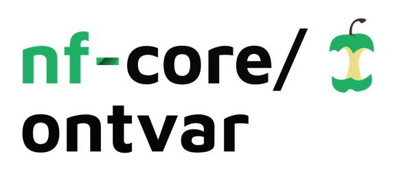
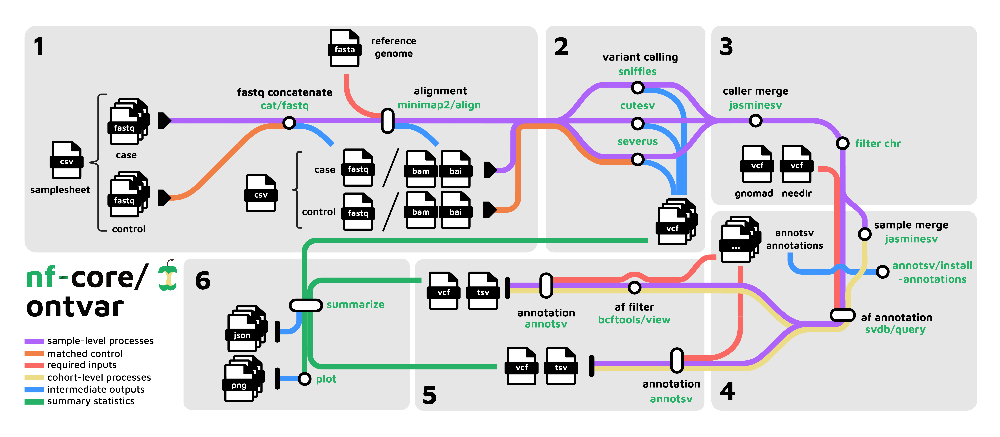

<h1>
  <picture>
    <source media="(prefers-color-scheme: dark)" srcset="docs/images/nf-core-ontvar_logo_dark.png">
    
  </picture>
</h1>

[](https://github.com/nf-core/ontvar/actions/workflows/nf-test.yml)
[](https://github.com/nf-core/ontvar/actions/workflows/linting.yml)[](https://nf-co.re/ontvar/results)[](https://doi.org/10.5281/zenodo.XXXXXXX)
[](https://www.nf-test.com)

[](https://www.nextflow.io/)
[](https://github.com/nf-core/tools/releases/tag/3.3.2)
[](https://docs.conda.io/en/latest/)
[](https://www.docker.com/)
[](https://sylabs.io/docs/)
[](https://cloud.seqera.io/launch?pipeline=https://github.com/nf-core/ontvar)

[](https://nfcore.slack.com/channels/ontvar)[](https://bsky.app/profile/nf-co.re)[](https://mstdn.science/@nf_core)[](https://www.youtube.com/c/nf-core)

## Introduction

**nf-core/ontvar** is a comprehensive somatic structural variant (SV) calling, filtering, annotation and consensus generation pipeline for Oxford Nanopore Technologies (ONT) long-read sequencing data.

### Key Features

- **Multi-caller SV detection**: Sniffles, cuteSV, and Severus for comprehensive variant discovery
- **Case-control aware analysis**: Support for tumor-normal paired analysis and tumor-only with panel of normals
- **Consensus calling**: Sample-level caller merging with configurable support thresholds
- **Population frequency filtering**: Integration with gnomAD and custom population databases
- **Comprehensive annotation**: AnnotSV provides gene-based and regulatory annotations
- **Cohort-level analysis**: Multi-sample variant merging and analysis
- **Interactive visualizations**: Detailed QC plots and summary statistics at each stage

## Workflow Overview



## Usage

> [!NOTE]
> If you are new to Nextflow and nf-core, please refer to [this page](https://nf-co.re/docs/usage/installation) on how to set-up Nextflow. Make sure to [test your setup](https://nf-co.re/docs/usage/introduction#how-to-run-a-pipeline) with `-profile test` before running the workflow on actual data.

The pipeline consists of the following major steps:

1. **SV Calling**: Run Sniffles, cuteSV, and Severus callers on input samples
2. **Sample Consensus**: Merge caller results per sample using Jasmine (with a configurable caller support threshold)
3. **Population Annotation**: Add allele frequency information from gnomAD and long-read sequencing based healthy population database: needLR
4. **Sample Filtering**: Remove common variants based on population frequencies
5. **Sample Annotation**: Comprehensive AnnotSV annotation of sample variants
6. **Cohort Merging**: Create cohort-wide merged callset using Jasmine
7. **Cohort Filtering**: Apply population frequency filters at cohort level
8. **Final Annotation**: AnnotSV annotation of final cohort callset
9. **QC & Visualization**: Generate summary statistics and plots at each stage

### Samplesheet Format

Each row represents a sample with the following columns:

| Column       | Required | Description                                                        |
|--------------|----------|--------------------------------------------------------------------|
| `group_id`   | Yes      | Sample group identifier for pairing                                |
| `sample_id`  | Yes      | Unique ID for each sample                                          |
| `sample_type`| Yes      | String indicating if sample is a `case` or `control`               |
| `input_type` | Yes      | Input data type: `fastq` or `bam`                                  |
| `input_path` | Yes      | Path to FASTQ file/directory or aligned BAM file                   |

**Input Types:**

- **FASTQ (`input_type: fastq`)**:
  - Can be a single FASTQ file (`.fastq`, `.fq`, `.fastq.gz`, `.fq.gz`)
  - Can be a directory containing multiple FASTQ files (will be concatenated)
  - Requires `--reference` parameter for alignment with minimap2
  
- **BAM (`input_type: bam`)**:
  - Must be aligned to the same reference genome specified with `--reference`
  - Must be coordinate-sorted and indexed (`.bam.bai` file should exist)
  - Skips alignment step

**Example samplesheet:**

```csv
group_id,sample_id,sample_type,input_type,input_path
group1,sample1,case,fastq,/path/to/fastq_dir/
group1,control1,control,bam,/path/to/control.bam
group2,sample2,case,fastq,/path/to/reads.fastq.gz
```


**Notes:**
- Samples with the same `group_id` are treated as paired (e.g., tumor-normal pairs)
- `sample_type` must be either `case` or `control`
- BAM files should be coordinate-sorted and indexed (.bai file should exist)


Now, you can run the pipeline using:

```bash
nextflow run nf-core/ontvar \
   -profile <docker/singularity/.../institute> \
   --input samplesheet.csv \
   --outdir <OUTDIR> \
   --reference reference.fa
```

### Required Parameters

| Parameter | Description                                           | Example                    |
|-----------|-------------------------------------------------------|----------------------------|
| `--input` | Path to comma-separated sample sheet file             | `path/to/samplesheet.csv`  |
| `--outdir`| Output directory path                                 | `path/to/outdir`           |
| `--reference` | Reference genome FASTA file                       | `path/to/reference.fa`     |

### AnnotSV Annotation Resources

AnnotSV requires annotation resources to function. The pipeline can automatically download these on first run, but it's recommended to download them once and reuse for subsequent runs to save time.

#### Automatic Download (First Run)

On the first run, AnnotSV will automatically download and install the annotation databases. This can take significant time (30+ minutes depending on internet speed and genome build).

```bash
nextflow run nf-core/ontvar \
   -profile docker \
   --input samplesheet.csv \
   --outdir results \
   --reference reference.fa
   # AnnotSV will auto-download annotations to default location
```

#### Reusing Annotation Resources (Recommended)

After the first run, AnnotSV annotations are cached in the output directory. To reuse them for subsequent runs:

```bash
nextflow run nf-core/ontvar \
   -profile docker \
   --input samplesheet.csv \
   --outdir results \
   --reference reference.fa \
   --annotsv_annotations /path/to/annotation/resources
```

#### Annotation Resource Location

**Default location** (after first run):
```
results/AnnotSV_annotations/
```

**Custom location**:
You can specify a custom annotation directory with `--annotsv_annotations`. 

#### Pre-downloaded Resources

If you have pre-downloaded AnnotSV resources from another source, you can point to them directly:

```bash
nextflow run nf-core/ontvar \
   -profile docker \
   --input samplesheet.csv \
   --outdir results \
   --reference reference.fa \
   --annotsv_annotations /path/to/your/AnnotSV/annotations
```


#### Supported Genome Builds

The pipeline supports the following genome builds for AnnotSV annotation:

- `hg38` (GRCh38) - Default
- `hg37` (GRCh37)
- `mm10` (GRCm38)
- `mm9` (GRCm37)

Specify the build with:
```bash
--genome_build GRCh37
```

### Customizing Pipeline Parameters

The pipeline offers extensive customization options for each step of the analysis. All parameters can be adjusted to fit your specific needs:

**SV Caller Parameters**: Fine-tune settings for Sniffles, cuteSV, and Severus including minimum mapping quality, SV size thresholds, read support requirements, and more.

**Consensus & Filtering Parameters**: Adjust caller support thresholds (e.g., require 2 or 3 callers), population frequency cutoffs, overlap ratios for merging, and distance thresholds.

**Annotation Parameters**: Configure AnnotSV annotation databases, genome builds, output formats, and annotation detail levels.

**Database Parameters**: Specify custom SVDB population databases, panel of normals files, and AnnotSV annotation paths.

These are configurable via command-line flags or in the `nextflow.config` file.

**Chromosome Filtering**

By default, the pipeline retains only main contigs (CHR1-22,X,Y,M). This is controlled in the `FILTER_CHR` module.

## Advanced Usage

### Custom Filtering Thresholds

Adjust caller support and population frequency thresholds:

```bash
nextflow run nf-core/ontvar \
   -profile docker \
   --input samplesheet.csv \
   --outdir results \
   --reference reference.fa \
   --min_caller_support 3 \        # Require 3/3 callers
   --max_gnomad_af 0.001 \         # Change population frequency cutoff
   --max_needlr_af 0.001
```

<!-- > [!WARNING]
> Please provide pipeline parameters via the CLI or Nextflow `-params-file` option. Custom config files including those provided by the `-c` Nextflow option can be used to provide any configuration _**except for parameters**_; see [docs](https://nf-co.re/docs/usage/getting_started/configuration#custom-configuration-files). -->

<!-- For more details and further functionality, please refer to the [usage documentation](https://nf-co.re/ontvar/usage) and the [parameter documentation](https://nf-co.re/ontvar/parameters). -->

## Pipeline output

To see the results of an example test run with a full size dataset refer to the [results](https://nf-co.re/ontvar/results) tab on the nf-core website pipeline page.
For more details about the output files and reports, please refer to the
[output documentation](https://nf-co.re/ontvar/output).

### Preprocessing Outputs (`results/alignment/`)

#### Alignment (`alignment/`)
Generated only when FASTQ inputs are provided. BAM inputs skip this step.

**Files**:
```
alignment/
├── sample1/
│   ├── sample1.bam
│   └── sample1.bam.bai
├── sample2/
│   ├── sample2.bam
│   └── sample2.bam.bai
└── ...
```

**Notes**:
- Uses minimap2 with preset `lr:hq` (Default preset used by Dorado aligner for ONT reads)
- BAM files are coordinate-sorted and indexed automatically
- For mixed inputs, FASTQ samples are aligned here and BAM samples skip to case-level analysis
- Concatenated FASTQ files (from `cat_fastq`) are not published by default

The pipeline generates outputs organized into case-level and cohort-level directories:

### Case-Level Outputs (`results/case/`)

#### 1. Raw Calls (`01_raw_calls/`)
- Individual caller VCFs for each sample
- Subdirectories: `sniffles/`, `cutesv/`, `severus/`
- Summary JSON and count plots

**Files**:
```
01_raw_calls/
├── sniffles/
│   ├── SAMPLE1_sniffles.vcf.gz
│   └── SAMPLE2_sniffles.vcf.gz
├── cutesv/
│   ├── SAMPLE1_cutesv.vcf
│   └── SAMPLE2_cutesv.vcf
├── severus/
│   ├── tumor_normal/
│   │   └── SAMPLE1_tn_severus.vcf
│   └── tumor_only/
│       └── SAMPLE2_to_severus.vcf
├── raw_calls_summary.json
├── raw_callers_plot_sv_counts_stacked.png
├── raw_callers_plot_sv_counts_callers.png
└── raw_callers_plot_sv_counts.png
```

#### 2. Caller Merged (`02_caller_merged/`)
- Sample-level consensus VCFs (filtereed by caller support)
- AnnotSV annotations (pre-filtering)
- Summary statistics and plots

**Files**:
```
02_caller_merged/
├── SAMPLE1.vcf
├── SAMPLE1.tsv                    # AnnotSV full annotation
├── SAMPLE1.annotated.tsv          # AnnotSV gene-level
├── caller_merged_summary.json
├── consensus_plot_sv_counts_stacked.png
└── consensus_plot_sv_counts.png
```

#### 3. Caller Merged Filtered (`03_caller_merged_filtered/`)
- Population frequency filtered VCFs
- Final AnnotSV annotations
- Summary statistics and plots

**Files**:
```
03_caller_merged_filtered/
├── SAMPLE1_filtered.vcf
├── SAMPLE1_filtered.tsv
├── SAMPLE1_filtered.annotated.tsv
├── filtered_summary.json
├── filtered_plot_sv_counts_stacked.png
└── filtered_plot_sv_counts.png
```

### Cohort-Level Outputs (`results/cohort/`)

**Files**:
```
cohort/
├── cohort_annotated.vcf                    # AnnotSV (pre-AF filtering)
├── cohort_annotated.tsv                    # AnnotSV (pre-AF filtering)
├── cohort_filtered.vcf                     # AnnotSV (post-AF filtering)
├── cohort_filtered.tsv                     # AnnotSV (post-AF filtering)
├── cohort_annotated_summary.json
├── cohort_annotated_sv_counts.png
├── cohort_filtered_summary.json
└── cohort_filtered_sv_counts.png
```

### MultiQC Report

A comprehensive HTML report combining all QC metrics:

```
results/multiqc/multiqc_report.html
```

### Summary JSON Format

Each `*_summary.json` file contains SV counts by:
- Sample
- Caller
- SV type (DEL, INS, DUP, INV, BND, etc.)

Example structure:
```json
{
  "analysis_type": "multi_sample",
  "samples": {
    "SAMPLE1": {
      "callers": {
        "sniffles": {
          "sv_types": {
            "DEL": {"count": 1234},
            "INS": {"count": 567}
          }
        }
      },
      "combined_stats": {
        "sv_types": {
          "DEL": {"count": 1500}
        }
      }
    }
  }
}
```

## Credits

nf-core/ontvar is written and maintained by Manas Sehgal.


### Tools Used

This pipeline integrates the following tools:

- [minimap2](https://github.com/lh3/minimap2) - Sequence alignment
- [Sniffles2](https://github.com/fritzsedlazeck/Sniffles) - SV calling from long reads
- [cuteSV](https://github.com/tjiangHIT/cuteSV) - Long-read SV detection
- [Severus](https://github.com/KolmogorovLab/Severus) - Somatic SV calling
- [Jasmine](https://github.com/mkirsche/Jasmine) - SV merging and comparison
- [AnnotSV](https://github.com/lgmgeo/AnnotSV) - Structural variant annotation
- [SVDB](https://github.com/J35P312/SVDB) - Structural variant population frequency annotation
- [BCFtools](https://github.com/samtools/bcftools) - VCF manipulation
- [MultiQC](https://multiqc.info/) - Quality control reporting

## Contributions and Support

If you would like to contribute to this pipeline, please see the [contributing guidelines](.github/CONTRIBUTING.md).

<!-- For further information or help, don't hesitate to get in touch on the [Slack `#ontvar` channel](https://nfcore.slack.com/channels/ontvar) (you can join with [this invite](https://nf-co.re/join/slack)). -->

## Citations

<!-- TODO nf-core: Add citation for pipeline after first release. Uncomment lines below and update Zenodo doi and badge at the top of this file. -->
<!-- If you use nf-core/ontvar for your analysis, please cite it using the following doi: [10.5281/zenodo.XXXXXX](https://doi.org/10.5281/zenodo.XXXXXX) -->

<!-- TODO nf-core: Add bibliography of tools and data used in your pipeline -->

An extensive list of references for the tools used by the pipeline can be found in the [`CITATIONS.md`](CITATIONS.md) file.

You can cite the `nf-core` publication as follows:

> **The nf-core framework for community-curated bioinformatics pipelines.**
>
> Philip Ewels, Alexander Peltzer, Sven Fillinger, Harshil Patel, Johannes Alneberg, Andreas Wilm, Maxime Ulysse Garcia, Paolo Di Tommaso & Sven Nahnsen.
>
> _Nat Biotechnol._ 2020 Feb 13. doi: [10.1038/s41587-020-0439-x](https://dx.doi.org/10.1038/s41587-020-0439-x).
